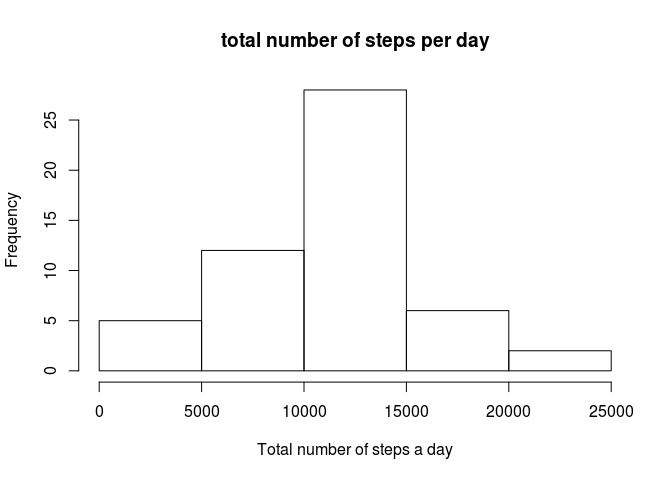
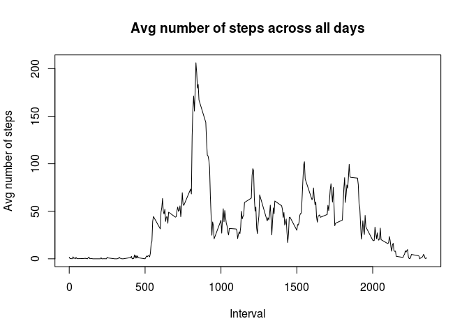
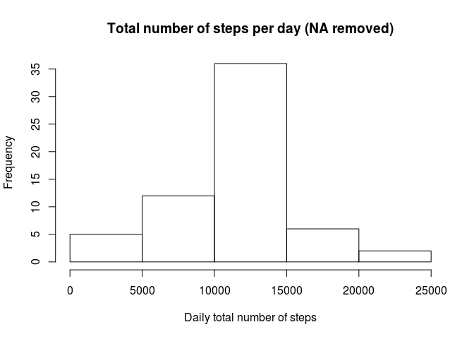
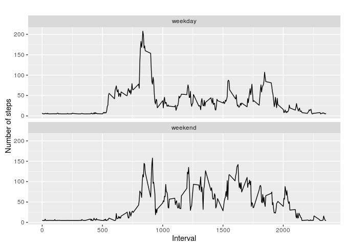

### Loading and preprocessing the data

``` r
# echo true is set in a global config in the R file
library(knitr)
library(dplyr)
```

    ## 
    ## Attaching package: 'dplyr'

    ## The following objects are masked from 'package:stats':
    ## 
    ##     filter, lag

    ## The following objects are masked from 'package:base':
    ## 
    ##     intersect, setdiff, setequal, union

``` r
library(ggplot2)

# set the file url 
fileUrl <- "https://d396qusza40orc.cloudfront.net/repdata%2Fdata%2Factivity.zip"

setwd( "/home/odelibalta/Documents/Study/Coursera/DataScientist/5_Reproducible_Research/Week2/Assignment" )
if ( ! file.exists( "./data" ) ) 
      dir.create( "./data" )
 

download.file( fileUrl, destfile = "./data/zipData.zip", method = "curl" )

# Unzip DataSet to /data directory
unzip(zipfile="./data/zipData.zip",exdir="./data")
```

### Load the data (i.e. read.csv())

``` r
df <- read.csv( './data/activity.csv', header=T, sep=',' ) 
```

### Process/transform the data (if necessary) into a format suitable for your analysis

``` r
# remove NA - most likely will be needed in the steps along 
data <- df[ with ( df, { !( is.na( steps ) ) } ), ]
```

### Calculate the total number of steps taken per day

``` r
daily <- group_by( data, date )
steps_per_day <- summarise( daily, total = sum( steps ) ) 
```

### Make a histogram of the total number of steps taken each day

``` r
hist( steps_per_day$total, main="total number of steps per day", xlab="Total number of steps a day")
```



### Calculate and report the mean and median of the total number of steps taken per day

``` r
summary( steps_per_day )
```

    ##          date        total      
    ##  2012-10-02: 1   Min.   :   41  
    ##  2012-10-03: 1   1st Qu.: 8841  
    ##  2012-10-04: 1   Median :10765  
    ##  2012-10-05: 1   Mean   :10766  
    ##  2012-10-06: 1   3rd Qu.:13294  
    ##  2012-10-07: 1   Max.   :21194  
    ##  (Other)   :47

### Make a time series plot (i.e. type = "l") of the 5-minute interval (x-axis) and the average number of steps taken, averaged across all days (y-axis)

``` r
steps_by_interval <- aggregate( steps ~ interval, data, mean )

plot( steps_by_interval$interval, steps_by_interval$steps, type='l', main="Avg number of steps across all days", 
      xlab="Interval", ylab="Avg number of steps")
```



### Which 5-minute interval, on average across all the days in the dataset, contains the maximum number of steps?

``` r
max_steps  <- which.max( steps_by_interval$steps )
steps_by_interval[ max_steps, ]
```

    ##     interval    steps
    ## 104      835 206.1698

*Interval 835 contains the maximum average value of steps (206.1698).*

### Calculate and report the total number of missing values in the dataset (i.e. the total number of rows with NAs)

``` r
sum( is.na( df ) )
```

    ## [1] 2304

### Devise a strategy for filling in all of the missing values in the dataset. The strategy does not need to be sophisticated. For example, you could use the mean/median for that day, or the mean for that 5-minute interval, etc.

``` r
# below is just the strategy, actual code is within the next step
mean( df$steps, na.rm = T )
```

    ## [1] 37.3826

### Create a new dataset that is equal to the original dataset but with the missing data filled in.

``` r
df_no_na <- df
# subset the na s and assign them the mean of the day
df_no_na$steps[is.na( df_no_na$steps ) ] <- mean( df_no_na$steps, na.rm = T )
```

### Make a histogram of the total number of steps taken each day and Calculate and report the mean and median total number of steps taken per day. Do these values differ from the estimates from the first part of the assignment? What is the impact of imputing missing data on the estimates of the total daily number of steps?

``` r
df_no_na_steps_daily <- aggregate( steps ~ date, df_no_na, sum )
hist(df_no_na_steps_daily$steps, main="Total number of steps per day (NA removed)", 
     xlab="Daily total number of steps")
```



``` r
# get mean and median of imputed data
mean( df_no_na_steps_daily$steps )
```

    ## [1] 10766.19

``` r
median( df_no_na_steps_daily$steps )
```

    ## [1] 10766.19

``` r
# get mean and median of data without NA's
mean( steps_per_day$total ) 
```

    ## [1] 10766.19

``` r
median( steps_per_day$total )
```

    ## [1] 10765

*While the median increases, mean value stays the same*

### Create a new factor variable in the dataset with two levels – “weekday” and “weekend” indicating whether a given date is a weekday or weekend day.

``` r
df_no_na['type_of_day'] <- weekdays( as.Date( df_no_na$date ) )
# subset the weekend days to the weekend
df_no_na$type_of_day[df_no_na$type_of_day  %in% c('Saturday','Sunday') ] <- "weekend"
# rest is the week
df_no_na$type_of_day[df_no_na$type_of_day != "weekend"] <- "weekday"
# this needs to be a vector 
df_no_na$type_of_day <- as.factor( df_no_na$type_of_day )
```

### Make a panel plot containing a time series plot (i.e. type = "l") of the 5-minute interval (x-axis) and the average number of steps taken, averaged across all weekday days or weekend days (y-axis). See the README file in the GitHub repository to see an example of what this plot should look like using simulated data.

``` r
df_no_na_avg_steps_interval <- aggregate( steps ~ interval + type_of_day, df_no_na, mean )

# creat a plot
qplot(interval, 
      steps, 
      data = df_no_na_avg_steps_interval,  
      geom = c("line"), 
      xlab = "Interval", 
      ylab = "Number of steps", 
      main = "") +
      facet_wrap(~ type_of_day, ncol = 1)
```


